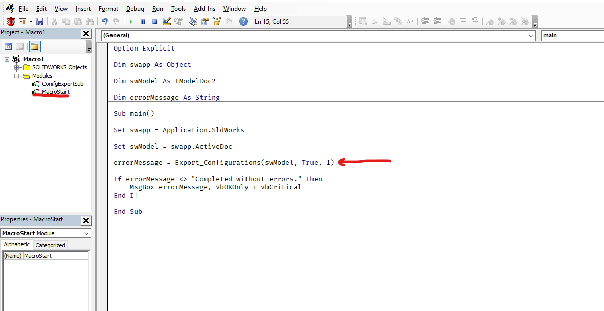

Export Configurations
=====================
This Solidworks Macro provides funcionality to export the configurations of a Solidworks file as .STEP files (AP214). The macro can be configured to export all configurations, just parent configurations, or all of the sub configurations of the selected parent config.

Running the Macro
-----------------
To run the macro, first download the "Export Configurations.swp" file. Now, simply open the document whose configurations you wish to export and run the macro. By default, it will save all configurations and prompt you for a save location.

In addition to this functionality, this macro can be easily configured for different export options. Additionally, the export functionality is set up as it's own function in an independent module so that it can be easily exported and incorporated into a larger macro. Below, you will find instructions for running the macro as is, as well as instructions for incorporating the function into your own macro.

Configuring the Macro
^^^^^^^^^^^^^^^^^^^^^
The core of the functionality is the "ConfigExportSub" module. To control the behavior of this module, the only line that will need modifying is the one shown in the image below in the "MacroStart" module:

As you can see, the "Export_Configurations" funtion accepts 3 arguments:

1. An IModelDoc2 variable, shown here as "swModel"

2. A boolean value, shown here set to True

3. An integer value, shown here set to 1

**1. IModelDoc2 variable**

- This variable should remain unchanged to run the macro as is. It's value is the model whose configurations you wish to export. In this case, the file you have open when running the macro.

**2. Boolean value**

- If set to "False" the macro will save all of your exported files in the same location as the Solidworks file in a folder named "ConfigExport"
    - If this folder already exists, it will provide the option to overwrite any conflicting contents.
- If set to "True" the macro will open a folder selection dialog that will allow you to select the folder in which you would like the exported files to be saved.

**3. integer Value**

- This value can be 0, 1, or 2
- If set to 0 it will save only the parent configurations contained within the open model. This includes "parent" configurations with no child configs.
- If set to 1 the macro will save all of the child configurations of the selected parent configuration.
    - If the active configuration is not a parent configuration, or if it has no child configurations, it will provide a warning and not run.
- If set to 2, then the macro will save all configurations, parent and child, that are contained in the active document.

Adding the function to other Macros
^^^^^^^^^^^^^^^^^^^^^^^^^^^^^^^^^^^
Once you understand the above function modifications, using this macro as a part of other macros is simple. 

- Download the "ConfigExportSub.bas" file.
- Within your macro, right click on modules and select import. Select the "ConfigExportSub.bas" file.
- Now you can call the "ConfigExportSub" function from anywhere else in your macro. just be sure to pass in appropriate arguments as described above.

License
-------
THE SOFTWARE IS PROVIDED "AS IS", WITHOUT WARRANTY OF ANY KIND, EXPRESS OR IMPLIED,
INCLUDING BUT NOT LIMITED TO THE WARRANTIES OF MERCHANTABILITY, FITNESS FOR A PARTICULAR PURPOSE AND NONINFRINGEMENT.
IN NO EVENT SHALL THE AUTHORS OR COPYRIGHT HOLDERS BE LIABLE FOR ANY CLAIM, DAMAGES OR OTHER LIABILITY,
WHETHER IN AN ACTION OF CONTRACT, TORT OR OTHERWISE, ARISING FROM, OUT OF OR IN CONNECTION WITH THE SOFTWARE
OR THE USE OR OTHER DEALINGS IN THE SOFTWARE.

`MIT License`_

.. _MIT License: ./LICENSE

Authors
-------
Written by `Ironic Mango Designs <https://IronicMango.com>`_.

